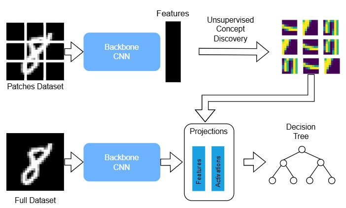

# UCBM MNIST Tree Classifier

This project implements a notebook-style MNIST concept bottleneck pipeline.
It follows the architecture shown in `Diagram.jpg`:



The flow is:

1. A backbone CNN extracts features from MNIST images.
2. Unsupervised concept discovery learns a concept bank from spatial activations.
3. The learned concepts are projected into concept space.
4. A UCBM classifier is trained on those projections.
5. A decision tree and visual explanations are generated from the learned concepts.

## Project Layout

- `main.py` runs the full notebook-style pipeline.
- `UCBM_MnistTree.ipynb` is the original notebook version.
- `core/mnist_tree_backbone.py` contains the notebook-style backbone and GAP helpers.
- `core/mnist_tree_concepts.py` contains spatial concept discovery and exemplar selection.
- `core/mnist_tree_ucbm.py` contains the three-phase UCBM training flow.
- `utils/visualization.py` contains the plotting helpers.
- `mycraft/craft_torch.py` keeps the original CRAFT implementation used by the older flow.

## What It Does

The current entrypoint mirrors the notebook process:

1. Load MNIST and split it into train, validation, and test sets.
2. Train or load the backbone CNN.
3. Discover concepts using spatial descriptors and NMF.
4. Train the UCBM classifier in three phases.
5. Save the concept bank, classifier state, and summary metrics.
6. Generate concept exemplar and decision visualizations in `outputs/`.

## Requirements

Install the Python dependencies first:

```bash
pip install -r requirements.txt
```

## Run

Run the full pipeline from the project root:

```bash
python main.py
```

If you only want to validate the notebook-style runner, you can also use:

```bash
python run_mnist_tree.py
```

## Outputs

After a successful run, the project writes artifacts to:

- `models/` for saved model files.
- `Model/` for the serialized UCBM classifier and info JSON.
- `outputs/` for concept and decision plots.

## Notes

- The notebook and the Python entrypoint now share the same backbone/concept/UCBM flow.
- The diagram is included directly from `Diagram.jpg`, so keep that file in the repository root.
